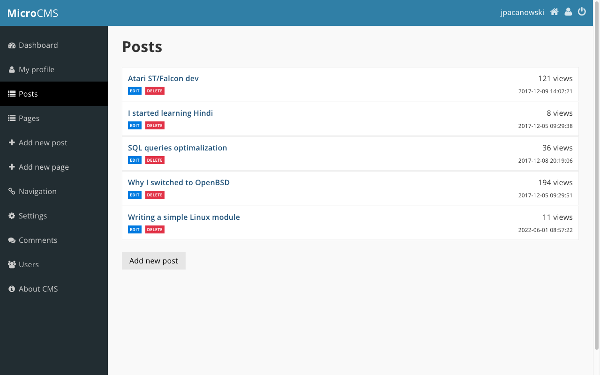
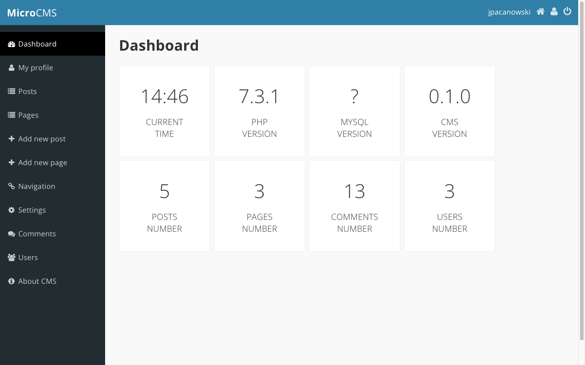

# MicroCMS

A content management system (CMS) in Laravel.

This simple CMS provides a user-friendly interface for managing your website content, including adding, editing, and deleting pages and blog posts.

This simple CMS provides a solid foundation for building your own website. With its user-friendly interface and powerful features, you can quickly get started managing your website content and creating engaging online experiences.

**Why is MicroCMS awesome?** MicroCMS is absolutely free and lightweight. Don't hesitate and feel free to do whatever you want with this awesome CMS. It won’t be big and professional like WordPress. The main reason I started working on this CMS was to create a very lightweight CMS.

**Do you like this awesome CMS?** Send me any feedback on things you like or dislike in this CMS. I’d like to know what features most people would want. Any suggestions are welcome.

## Key Features

- Simple and intuitive admin interface
- Support for multiple page types (pages, blog posts, etc.)
- User management (create, edit, and delete user accounts)
- User authentication (login, logout, and session management)

## Example Usage

- Create a blog website with multiple categories and authors.
- Develop a simple company website with pages about your products, services, and team.
- Build a personal portfolio website to showcase your work and projects.

### License
[MIT](https://mit-license.org/)
